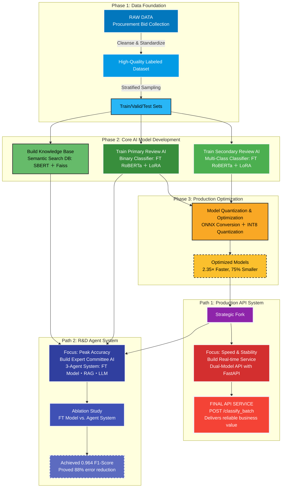

 [**English**](readme.md) | [**한국어**](readme_kr.md)

# nlp-analysis-agent: An End-to-End AI System


An End-to-End AI agent system for public procurement analysis, achieving a 96.4% F1-score by leveraging a fine-tuned RoBERTa, RAG, and LLMs. This project demonstrates a full-cycle development process from ideation and data collection to model optimization and API deployment.

<!-- A GIF showcasing the Agent System or the final API in action would go here. -->

## 1. Overview: From a Business Problem to a Production API

This project was born from a real-world business challenge: the inefficient and error-prone process of manually reviewing hundreds of public procurement bids daily at a civil engineering firm. This manual process not only consumed significant human resources but also risked missing critical business opportunities.

This repository documents the journey of building an End-to-End solution single-handedly. It covers everything from **data collection and refinement** and **core AI model development and optimization**, to the final deployment of a **real-time, production-ready API**.

The project culminates in two key deliverables:
1.  **A Stable Production API:** A highly optimized dual-model system built for speed, stability, and immediate business integration.
2.  **A High-Performance R&D Agent:** An intelligent agent system designed to push the boundaries of accuracy, mimicking the decision-making process of a human expert.

---

## 2. Solution Architecture

The entire project is structured as a systematic pipeline, flowing from data foundation to model development, optimization, and final service delivery.



---

## 3. Performance Analysis: From Simple Automation to an Intelligent Expert System

This project evolved in two stages: first, building a robust automation system, and second, proving the potential of a more intelligent expert system that overcomes the limitations of the first.

#### **Evolution 1: The Robust Automator**
*   **Reliable Task Handling:** A core engine was developed by fine-tuning `klue/roberta-large`, achieving a high F1-Score of **0.97** in determining bid eligibility. This model forms the backbone of the fast and reliable production API.

#### **Evolution 2: The Intelligent Expert**
*   **Mimicking Human Decision-Making:** Simple fine-tuned models can be brittle on ambiguous, boundary-case problems. To solve this, a 3-agent system was designed, where a **Fine-Tuned Model (Initial Review) + RAG (Case Search) + LLM (Final Judgment)** collaborate to make a decision.
*   **Breakthrough Performance:** This agent-based approach dramatically improved judgment accuracy on complex cases, boosting the overall system's **F1-Score from a baseline of 0.7045 to 0.9639**. This represents an **88% reduction in the error rate** compared to the standalone fine-tuned model on challenging data.


---

## 4. Optimization for Production

A powerful model is useless if it's not fast and efficient in a real-world service environment. Targeting a CPU-only server deployment, the trained PyTorch models were optimized through **ONNX conversion and INT8 quantization**.

*(Insert your quantization performance comparison table here.)*
| Metric          | FP32 PyTorch (Baseline) | INT8 ONNX (Quantized) | Delta (Change)                     |
|:----------------|------------------------:|----------------------:|:-----------------------------------|
| **F1-Score**    | **0.9719**              | **0.9739**           | **+0.0020 (+0.20%)**               |
| Model Size (MB) | 1280.75                 | 323.24               | -74.76%                            |
| Latency (ms)    | 103.98                  | 44.15                | **-57.54% (2.35x faster)**         |

**Analysis:** Remarkably, the optimization process resulted in **zero performance degradation**—in fact, the F1-Score slightly increased. We achieved a **2.35x speedup in inference and a 75% reduction in model size**, making the system perfectly viable for a cost-effective CPU-only API service.

---

## 5. Project Structure & How to Run

The project is designed with a modular, role-based structure for clarity and scalability.

### Project Structure
```
Bid-Analysis-Agent/
├── src/
│   ├── core_training/          # The "Brain Factory": Scripts for training core models
│   ├── production_api/       # The "Workplace": Production-ready API logic
│   ├── research_agent_system/  # The "Lab": R&D agent system logic
│   └── shared_utils/           # The "Heart": Common utilities (data, models, etc.)
├── data/
├── notebooks/                  # EDA and initial experiments
├── output/                     # All artifacts: models, results, vector DB
├── config.py
└── README.md
```

### How to Reproduce
1.  **Setup Environment:**
    ```bash
    pip install -r requirements.txt
    ```
2.  **Process Data:**
    ```bash
    python src/shared_utils/data_processing.py
    ```
3.  **Train Core Models:**
    ```bash
    python src/core_training/train_binary.py
    python src/core_training/train_multiclass.py
    ```
4.  **Run API Server:**
    ```bash
    python src/production_api/main.py
    ```

---

## 6. Tech Stack
*   **Language:** Python
*   **Core Libraries:** PyTorch, Transformers, PEFT(LoRA), LangGraph
*   **API & Deployment:** FastAPI, Uvicorn, ONNX Runtime
*   **Data Handling:** Pandas, Faiss, Scikit-learn
*   **Environment:** Conda

---

## License
This project is licensed under the **MIT License**. See the `LICENSE` file for details.

## Author
*   **Harim Choi (HarimxChoi)**
*   **Email:** 2.harim.choi@gmail.com
