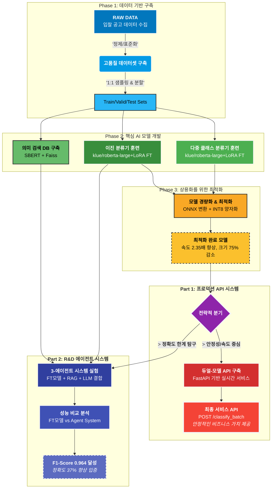

[**English**](readme.md) | [**한국어**](readme_kr.md)

# nlp-analysis-agent


🤖 An End-to-End AI agent system for Korean public procurement analysis, achieving 96.4% F1-score by leveraging a fine-tuned RoBERTa, RAG, and LLMs.

<!-- 
[ GIF ]

-->

## 1. 개요: 아이디어부터 API 서비스까지

이 프로젝트는 토목설계회사에서 매일 수백 건의 입찰 공고를 수동으로 검토하며 발생하는 비효율과 잠재적 기회 손실을 해결하기 위해 시작되었습니다.

단순한 AI 모델 개발을 넘어, 아이디어 구상부터 **필요한 데이터를 직접 수집 및 정제**하고, **핵심 AI 모델을 개발 및 최적화**했으며, 최종적으로 다른 시스템과 연동 가능한 **실시간 API 서비스까지 혼자 힘으로 구축**한 End-to-End 솔루션 구축기입니다.

이 프로젝트는 두 가지 핵심적인 결과물을 포함합니다:

1. **안정적인 프로덕션 API:** 속도와 안정성을 최우선으로 고려한, 즉시 서비스 가능한 듀얼-모델 시스템.
2. **고성능 R&D 에이전트:** 정확도의 한계를 탐구하기 위해 설계된, 인간 전문가의 의사결정 과정을 모방하는 지능형 에이전트 시스템.

---

## 2. 최종 솔루션 아키텍처

이 프로젝트의 전체적인 흐름은 데이터 처리부터 모델 개발, 최적화, 그리고 최종 API 서비스 제공까지 체계적인 파이프라인으로 구성되어 있습니다.
+



---

## 3. 성능 심층 분석: 현실적인 제품과 미래를 위한 연구

### Part 1. 현재의 솔루션: 안정적인 프로덕션 API

실시간 서비스의 안정성과 속도, 비용 효율성을 최우선으로 고려하여, 두 개의 최적화된 파인튜닝(FT) 모델을 기반으로 한 API를 구축했습니다.

* **모델 1: 이진 분류기:** `klue/roberta-large` 기반, 입찰 가능 여부를 97% 이상의 정확도로 판단합니다.
* **모델 2: 다중 클래스 분류기:** `klue/roberta-large` 기반, 20개 이상의 세부 용역으로 정밀하게 분류합니다.

### Part 2. 미래를 향한 탐구: 지능형 에이전트 시스템

여기서 멈추지 않고, 단일 모델의 한계를 극복하기 위해 '인간 전문가의 의사결정 과정'을 모방하는 더 높은 수준의 AI 시스템을 설계하고 그 성능을 검증했습니다.

* **실험 설계:** 단순 FT 모델의 성능을 베이스라인으로, RAG를 결합한 접근법, 그리고 최종적으로 **3-에이전트 시스템**의 성능을 비교 분석했습니다.
* **핵심 결과:** 실험 결과, 3-에이전트 시스템은 특히 애매한 경계선상의 문제에서 단일 FT 모델 대비 **F1-Score를 0.7045에서 0.9639로 약 37% 향상**시키는 압도적인 성능을 보여주었습니다.

<!-- [ F1-Score 비교 그래프를 여기에 삽입하세요. ] -->


---

## 4. 상용화를 위한 모델 최적화

아무리 훌륭한 모델도 실제 서비스 환경에서 빠르고 효율적으로 동작하지 않으면 가치가 없습니다. CPU-only 서버 배포를 목표로, 훈련된 모델에 **ONNX 변환 및 INT8 양자화**를 적용하여 경량화 및 최적화를 수행했습니다.

<!-- [ 양자화 전/후 성능 비교표를 여기에 삽입하세요. ] -->
| Metric | FP32 PyTorch (Baseline) | INT8 ONNX (Quantized) | Delta (변화량) |
|:---|---:|---:|:---|
| **F1-Score** | **0.9719** | **0.9739** | **+0.0020 (+0.20%)** |
| Model Size (MB) | 1280.75 | 323.24 | -74.76% |
| Latency (ms) | 103.98 | 44.15 | **-57.54% (2.35x faster)** |

**분석:** 놀랍게도, **성능 저하 없이 오히려 F1-Score가 0.2%p 향상**되면서, **추론 속도는 2.35배 빨라지고 모델 크기는 75% 감소**하는 이상적인 결과를 달성했습니다. 이는 CPU 서버 환경에서도 충분히 실용적인 API 서비스를 가능하게 합니다.

---

## 5. 프로젝트 구조 및 실행 방법

### Project Structure

```
Bid-Analysis-Agent/
├── src/
│   ├── production_api/       # 실제 서비스 API 로직
│   ├── research_agent_system/  # R&D 에이전트 시스템 로직
│   ├── core_training/          # 핵심 모델 훈련 스크립트
│   └── shared_utils/           # 공통 유틸리티
├── data/
├── notebooks/                  # 데이터 탐색 및 초기 실험
├── output/                     # 모델, 결과, 벡터DB 등 산출물
├── config.py
└── README.md
```

### How to Reproduce

1. **환경 설정:**

    ```bash
    pip install -r requirements.txt
    ```

2. **데이터 전처리:**

    ```bash
    python src/shared_utils/data_processing.py
    ```

3. **모델 훈련:**

    ```bash
    python src/core_training/train_binary.py
    python src/core_training/train_multiclass.py
    ```

4. **API 서버 실행:**

    ```bash
    python src/production_api/main.py
    ```

---

## 6. 기술 스택 (Tech Stack)

* **Language:** Python
* **Core Libraries:** PyTorch, Transformers, PEFT(LoRA), LangGraph
* **API & Deployment:** FastAPI, Uvicorn, ONNX Runtime
* **Data Handling:** Pandas, Faiss, Scikit-learn
* **Environment:** Conda

---

## License

This project is licensed under the **MIT License**. See the `LICENSE` file for details.

## Author

* **최하림**
* **Email:** 2.harim.choi@gmail.com
* **LinkedIn:** 
* **Medium:** 
